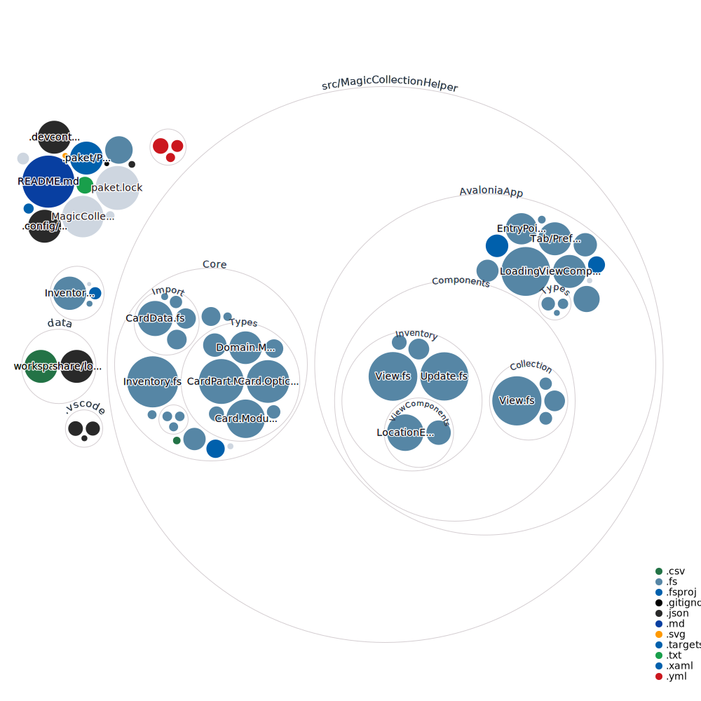

# MagicCollectionHelper
[](https://github.com/NicoVIII/MagicCollectionHelper/actions/workflows/build.yml)


This is (for now) a small tool which helps analysing MTG collections exported as CSV
from the brilliant website <https://deckstats.net>.

To run it you can download it from the release page (there is always a release with the latest code)
and execute it.
Your exported data from deckstats has to be placed inside of the same directory as the executable is.
It is typically called something like `collection_000000_0000_0000000000.csv`.

When starting the program and importing your collection, the program will take the newest csv inside
of the folder of the executable.

You can adjust your preferences in the preferences tab of the application.

For now this project is very experimental. But maybe if I have the time and motivation I will
further work on this and make it easier to use and more powerful.

### Inventory

Now you can automatically sort your cards into locations by certain rules. This helps organising your
collection and check, if everything is where it should be.
You need to include set (often set number) and language so that the cards can be used in the inventory.

To define your location you have to use a json for now, but you will be able to define them inside of
the application eventually.

The json is located at ~/.local/share/magic-collection-helper/locations.json
(Windows: %appdata%/magic-collection-helper/save/locations.json) and looks like this for me atm:

```json
{
  "data": [
    {
      "name": "Collection GRN",
      "rules": {
        "inSet": [
          "GRN",
          "TGRN"
        ],
        "inLanguage": "en",
        "isFoil": false,
        "isToken": null,
        "typeContains": null,
        "typeNotContains": null,
        "limit": null,
        "limitExact": 1,
        "rarity": null,
        "colorIdentity": null
      },
      "sortBy": [
        "BySet",
        "ByCollectorNumber"
      ]
    },
    [..]
    {
      "name": "Collection KHM",
      "rules": {
        "inSet": [
          "KHM",
          "TKHM"
        ],
        "inLanguage": "en",
        "isFoil": false,
        "isToken": null,
        "typeContains": null,
        "typeNotContains": null,
        "limit": null,
        "limitExact": 1,
        "rarity": null,
        "colorIdentity": null
      },
      "sortBy": [
        "BySet",
        "ByCollectorNumber"
      ]
    },
    {
      "name": "Foil basic lands",
      "rules": {
        "inSet": null,
        "inLanguage": null,
        "isFoil": true,
        "isToken": null,
        "typeContains": [
          "Basic Land"
        ],
        "typeNotContains": null,
        "limit": null,
        "limitExact": 1,
        "rarity": null,
        "colorIdentity": null
      },
      "sortBy": [
        "ByColorIdentity",
        "BySet",
        "ByCollectorNumber"
      ]
    },
    {
      "name": "Lookup 1 (Lands)",
      "rules": {
        "inSet": null,
        "inLanguage": null,
        "isFoil": null,
        "isToken": null,
        "typeContains": [
          "Land"
        ],
        "typeNotContains": [
          "Basic Land"
        ],
        "limit": 1,
        "limitExact": null,
        "rarity": [
          "Rare",
          "Mythic",
          "Special",
          "Bonus"
        ],
        "colorIdentity": null
      },
      "sortBy": [
        "ByColorIdentity",
        "BySet"
      ]
    },
    {
      "name": "Lookup 1 (Colorless)",
      "rules": {
        "inSet": null,
        "inLanguage": null,
        "isFoil": null,
        "isToken": false,
        "typeContains": null,
        "typeNotContains": [
          "Land"
        ],
        "limit": 1,
        "limitExact": null,
        "rarity": [
          "Rare",
          "Mythic",
          "Special",
          "Bonus"
        ],
        "colorIdentity": [
          []
        ]
      },
      "sortBy": [
        {
          "ByTypeContains": [
            "Land",
            "Creature",
            "Sorcery",
            "Instant",
            "Enchantment",
            "Artifact",
            "Planeswalker"
          ]
        },
        "ByCmc",
        "BySet"
      ]
    },
    {
      "name": "Lookup 2 (Lands)",
      "rules": {
        "inSet": null,
        "inLanguage": null,
        "isFoil": null,
        "isToken": null,
        "typeContains": [
          "Land"
        ],
        "typeNotContains": [
          "Basic Land"
        ],
        "limit": 1,
        "limitExact": null,
        "rarity": [
          "Common",
          "Uncommon"
        ],
        "colorIdentity": null
      },
      "sortBy": [
        "ByColorIdentity",
        "ByName"
      ]
    },
    {
      "name": "Lookup 2 (Colorless)",
      "rules": {
        "inSet": null,
        "inLanguage": null,
        "isFoil": null,
        "isToken": false,
        "typeContains": null,
        "typeNotContains": [
          "Land"
        ],
        "limit": 1,
        "limitExact": null,
        "rarity": [
          "Common",
          "Uncommon"
        ],
        "colorIdentity": [
          []
        ]
      },
      "sortBy": [
        {
          "ByTypeContains": [
            "Land",
            "Creature",
            "Sorcery",
            "Instant",
            "Enchantment",
            "Artifact",
            "Planeswalker"
          ]
        },
        "ByCmc",
        "ByName"
      ]
    },
    {
      "name": "Lookup 1 (White)",
      "rules": {
        "inSet": null,
        "inLanguage": null,
        "isFoil": null,
        "isToken": false,
        "typeContains": null,
        "typeNotContains": [
          "Land"
        ],
        "limit": 1,
        "limitExact": null,
        "rarity": [
          "Uncommon",
          "Rare",
          "Mythic",
          "Special",
          "Bonus"
        ],
        "colorIdentity": [
          [
            "White"
          ]
        ]
      },
      "sortBy": [
        {
          "ByTypeContains": [
            "Land",
            "Creature",
            "Sorcery",
            "Instant",
            "Enchantment",
            "Artifact",
            "Planeswalker"
          ]
        },
        "ByCmc",
        {
          "ByRarity": [
            [
              "Common"
            ],
            [
              "Uncommon"
            ],
            [
              "Rare",
              "Mythic",
              "Special",
              "Bonus"
            ]
          ]
        },
        "BySet"
      ]
    },
    {
      "name": "Lookup 2 (White)",
      "rules": {
        "inSet": null,
        "inLanguage": null,
        "isFoil": null,
        "isToken": false,
        "typeContains": null,
        "typeNotContains": [
          "Land"
        ],
        "limit": 1,
        "limitExact": null,
        "rarity": [
          "Common"
        ],
        "colorIdentity": [
          [
            "White"
          ]
        ]
      },
      "sortBy": [
        {
          "ByTypeContains": [
            "Land",
            "Creature",
            "Sorcery",
            "Instant",
            "Enchantment",
            "Artifact",
            "Planeswalker"
          ]
        },
        "ByCmc",
        "ByName"
      ]
    },
    [..]
    {
      "name": "Lookup (Mixed 1)",
      "rules": {
        "inSet": null,
        "inLanguage": null,
        "isFoil": null,
        "isToken": null,
        "typeContains": null,
        "typeNotContains": null,
        "limit": 1,
        "limitExact": null,
        "rarity": null,
        "colorIdentity": [
          [
            "White",
            "Blue"
          ],
          [
            "White",
            "Green"
          ],
          [
            "Blue",
            "Black"
          ],
          [
            "Black",
            "Red"
          ],
          [
            "Red",
            "Green"
          ]
        ]
      },
      "sortBy": [
        {
          "ByTypeContains": [
            "Land",
            "Creature",
            "Sorcery",
            "Instant",
            "Enchantment",
            "Artifact",
            "Planeswalker"
          ]
        },
        "ByCmc"
      ]
    },
    {
      "name": "Lookup (Mixed 2)",
      "rules": {
        "inSet": null,
        "inLanguage": null,
        "isFoil": null,
        "isToken": null,
        "typeContains": null,
        "typeNotContains": null,
        "limit": 1,
        "limitExact": null,
        "rarity": null,
        "colorIdentity": null
      },
      "sortBy": [
        "ByCmc"
      ]
    }
  ],
  "version": 1
}
```

Maybe this can help creating your own locations.

## Development


### How to start

To develop I strongly suggest you use VScode and the provided devcontainer.
You just need VScode and Docker installed on your machine, the rest is provided inside
the devcontainer.

Simply open the cloned folder and VScode should provide you with an option to reopen
inside the container in the bottom right corner.
If it does not, you can do that manually by triggering the "Rebuild and reopen
in devcontainer" option in the "all commands" window (Strg + Shift + P on Windows and Linux).

If Ionide doesn't start, type "dotnet run build" once. Then close VScode and reopen it.
After a few reopens this way Ionide should work. I don't know why it struggles lately.

### How to work

To build the application you can use `dotnet run build`.
To run the tests you can use `dotnet run test`.
To run the application you can use `dotnet run` or the launch configuration of
VScode. The application is run inside a lite-desktop inside the container you can
connect with via VNC (Port 5901).
If you don't have a VNC client installed, you can simply browse to http://localhost:6080
and see the desktop there. The password is "vscode" (for more information on that
see https://github.com/microsoft/vscode-dev-containers/blob/main/script-library/docs/desktop-lite.md).
